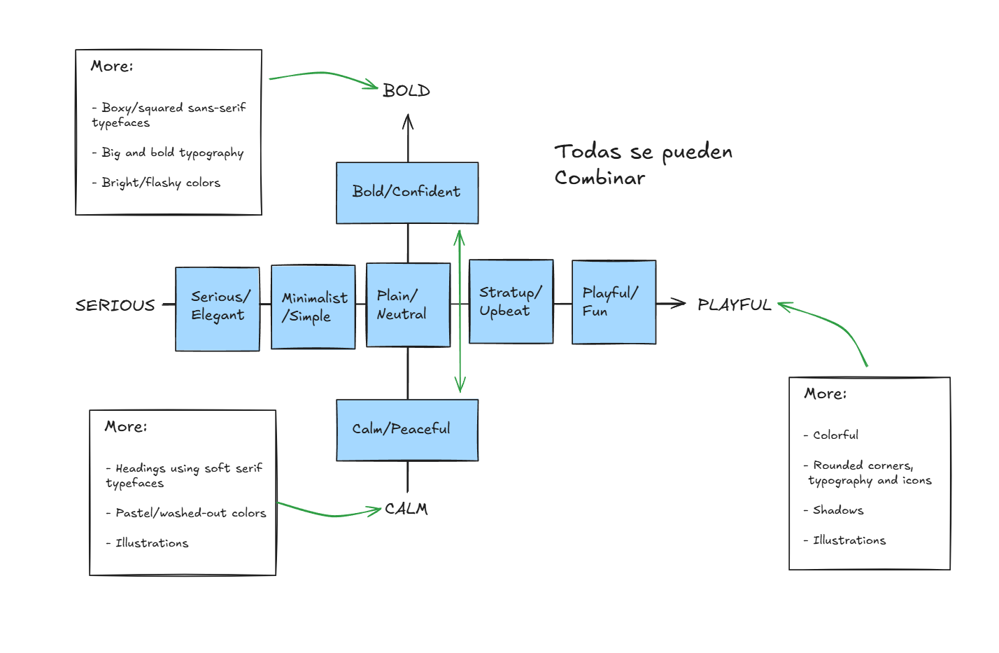

### Span

Inline annotation, pero no tiene ningún significado semántico

```
<li>
  <span>Comfortable for 4h</span>
</li>
```

Es mas o menos como un div, que no tiene ningún significado, pero para los elementos en linea
Cuando ocupamos un pequeño fragmento de texto, usamos span

### blockquote - text line

Esto es como para citar a alguien, o escribir algún testimonio, citar contenido textual que proviene de otra fuente, generalmente con una sangría para indicar que es una cita extensa o destacada.

```
<blockquote cite="https://www.ejemplo.com/articulo">
  La educación es el arma más poderosa que puedes usar para cambiar el mundo.
</blockquote>
```

Lo de la cita es opcional, poner de donde viene esa cita, pero recomendable

### figure

Se usa para agrupar contenido multimedia o ilustraciones (como imágenes, gráficos, videos, fragmentos de código, etc.) que están relacionados con el contenido principal, pero que pueden entenderse por sí solos.

Se usan en product cards, o se puede usar el article, pero figure es como un estándar

> Usos de figure

- Para envolver una imagen con su pie de foto
- Para acompañar diagramas, códigos, videos, etc., con una descripción.

Se suele usar junto con la etiqueta `<figcaption>`, que añade un pie de figura o descripción

```
<figure>
  
  <figcaption>Paisaje montañoso durante el atardecer.</figcaption>
</figure>
```

## Overview of Web Design and Website Personalities

> Web designers

`Web designers` crean el look and feel de una website
Solo usaban programas como sketch, Figma o photoshop

Pero ahora, hay muchos designers que programan, y muchos programadores que diseñan

> Web developers

`Web developers` implementan el design using HTML, CSS and Javascript code

> Good Design

- Cuando un usuario ingresa a una pagina, un buen design causa una buena impresión de la marca y el producto
- Hace que el usuario crea en la pagina o en este caso la marca
- Incrementa el valor de la marca o producto que el usuario esta visitando

- Hace que el usuario encuentre justo lo que necesita, ej si busca un producto, que la pagina de toda la información lo mas rápido posible

Good web design is nos subjective or creative -> Everyone can learn basics by following a framework/system

### Ingredients of Web Design

- Topography que consiste en formatear y diseñar el texto
- Colors
- Images/Illustrations
- Icons
- Shadows
- Border-radius la redondez de los elementos en una pagina
- Whitespace
- Visual Hierarchy
- User Experience
- Components/layouts

Design or decisions for each ingredient are based on `website personality`

> Revisar video 67 HTML CSS - Jonas

Las diferentes reglas de como sera la página, dependerán del estilo que se desee construir para el sitio

## Web Design Rules #1: Typography

- Usar tipografías conocidas y populares, jugar a lo seguro(sans serif inter)
- Esta bien usar solo un tipo de letra, máximo dos
- Escoger acorde a la personalidad(decidir entre serif y sans serif)
- Font sizes, usar una type scale, u otro rango pre definido
- For normal text(font-size entre 16px y 32px)
- For long text(like blog post) usar 20px o mas, los que describen secciones
- For headlines, you can go big(50px+) and bold(600+), depending on personality
- For any text, don't use a font weight under 400(regular)

> Create a good reading experience

- Usar menos de 75 caracteres por linea
- For normal-sized text, use a line height between 1.5 and 2, big text go menos de 1.5
  Mientras mas grande sea el texto menos line height deberá tener
- Disminuir letter spacing in headlines, if it looks unnatural
- Experiment todo with capitalize para títulos pequeños. Make them small and bold an increase letter-spacing
- Usually, don't justify text(es una convención mas que nada)
- No center long text blocks. Small blocks are fine

  > En sans serif

  - inter
  - open sans
  - roboto
  - Montserrat
  - work sans
  - Lato

  > En serif

  - Merriweather
  - Aleo
  - Playfair Display
  - Cormorant
  - Cardo
  - Lora

Estas letras están en Google Fonts, y font squirrel

La tipografía es el arte y la técnica of disponer los tipos para hacer que lenguaje escrito sea legible y también atractivo cuando se aplica.

Es sobre hacer un texto hermoso y fácil de leer

> Serif

- Tiene como colas al final de las lineas(serifs)
- Lo podemos usar para hacer interfaces mas tradicionales/luxury
- Es bueno para textos largos, como artículos o una revista online

> Sans serif

- No tiene las lineas decorativas
- Luce limpio y simple
- Sirve para interfaces modernas
- Es mas fácil escoger un tipo para que encaje en la personalidad de la pagina

## Implementing Typography

Siempre que se implemente la tipografía en el html, hacerlo antes del link de nuestro archivo CSS
Y se añade asi

```
body {
  font-family: "Inter", sans-serif;
}
```

El nombre de la letra justo como esta escrito en Google Fonts
Se pone la coma antes y entre comillas, para decir que se la da prioridad a ese estilo

> Line Height and Letter spacing

Ambos se toman en pixeles

```
line-height: 1.1; <!-- Entre 1, 1.5 and 2 normal, big text go menos de 1.5 -->
letter-spacing: -1; <!-- -1px de lo normal -->
```

## Web Design Rules #2: Colors

1. Make de main color match your website's personality: colors convey meaning!
2. Use a good color tone! Don't choose a random tone or CSS named colors

- Red draws a lot of attention, and symbolizes power, passion and excitement
- Orange is similar solo que less aggressive, and conveys happiness, cheerfulness and creativity
- Yellow means joy, brightness and intelligence
- Greens represents harmony, nature, growth and health
- Blue is associated with peace, trustworthiness, and professionalism
- Purple conveys wealth, wisdom and magic
- Pink represents romance, care and affection
- Brown is associated with nature, durability and comfort
- Black simbolices power, elegance and minimalism, but also grief and sorrow

3. You need at least two types of colors in your color palette: a main color and a grey color
   En si serian el color principal(usado para color de fondo, botones etc) y el color secundario(usado para letras, contraste etc), el accent(con mas experiencia) puede ser un color para remarcar algo importante
4. With more experience, you can add more colors: accent(secondary) colors(use a tool)
5. For diversity, create a lighter and a darker "versions"(tints and shades)
   Los mas claros se llamaran `tins`, y los mas oscuros `shades`
   Para escoger el `main`, `grey` y `accent` color, usar una herramienta como `palleton.com`
6. Use your main color to draw attention to the most important elements on the page
7. Use colors to add interesting accents or make entire components or sections
8. You can try to use tour color strategically in images and illustrations
   Por ejemplo se puede usar el main color dentro de las imágenes, para hacer dinámico y como un juego
9. On the dark colored backgrounds, try to use a tint of the background("lighter version") for text
10. Text should usually not be completely black. Lighten if up it looks heavy and uninviting
11. Don't make text too light! Use a tool to check contrast between text and background colors
    Contrast ratio needs to be at least 4:5:1 for normal text and 3:1 for large text(18px+)

### When and How to use colors

The `primary color` es usado en buttons

## Implementing Colors

```
.btn:link,
.btn:visited {
  background-color: #087f5b;
  color: #fff;
  text-decoration: none;
  text-transform: uppercase;
  padding: 16px 32px;
  display: inline-block;
}
```

Se usa un `inline-block` ya que el elemento button, al ser inline, no crea un espacio vertical, y block si lo crea pero ocupa todo el espacio posible

> Dos clases en un elemento

```
btn btn--small
```

Solemos añadir una que es la general en este caso para todos los botones

- Main color - color principal de la marca: botones primarios, enlaces activos, elementos clave(encabezados, iconos importantes), fondo de navegación o barra superior
- Grey color - escala de grises o neutro: fondos suaves, bordes, texto secundario, etiquetas, descripciones, estados deshabilitados
- Accent color - enfatizar acciones o datos importantes: notificaciones, indicadores activos, resultados importantes, iconos decorativos o decoraciones sutiles

## Web Design Rules #3: Images and Illustrations

1. Different types of images: product photos, storytelling photos, illustrations, patterns
2. Use images to support your website's message and story. So only use relevant images!
3. Prefer original images. If not possible, use original-looking stock images(not generic ones!), mejor buscar imágenes que luzcan autenticas y reales
4. Try to use `real people` to trigger user's emotions
5. If necessary, crop images to fit your message
6. Experiment combining photos, illustrations and patterns
7. Handling text on images: Darker or brighten image(completely or partially, using a gradient)
8. Position text into a neutral image area(dejarlo en un area de fondo de un solo color por ejemplo)
   Solo debemos de tener en cuenta dispositivos móviles, ya que el texto se puede sobreponer
9. Put text in a box
10. Tener en cuenta high-res screens, make image dimensions 2x o 3x as big as their displayed size
    En celulares como el iPhone, se ocupan 3px para mostrar 1px o 2px
11. Compress images for a lower file size and better performance
12. When using multiple images side by side, make sure they have the exact same dimensions
    Or at least el mismo aspect ratio

> Product photos

Para ilustrar el producto que se trata de vender en el website

> Storytelling photos

Se usan para contar una historia o transmitir un mensaje del sitio, no muestran el producto en si, sino alguien usando el producto
O haciendo algo que este relacionado con el producto o con el mensaje del sitio

> Illustrations

Es básicamente una forma mas abstracta de hacer un story telling, adicionan originalidad al website
Y resaltan la personalidad de nuestro sitio, pueden ser 2d o 3d

> Patterns

Pueden aparecer como un fondo de secciones enteras, o atrás de imágenes para adicionar un estilo visual interesante
Pueden añadir creatividad a nuestro sitio, `no usarlas en exceso`

## Web Design Rules #4: Icons

1. Use a good icon pack - or use emojis too
2. Use only one icon pack. Don't mix icons from different icon packs
3. Use SVG icons or icon fonts. Don't use bitmap image formats(.jpg and .png) Esto porque son vector-based

`NO violar las leyes de derechos de autor`

4. Adjust to website personality! Roundness, weight and filled/outlined depend on Typography

Algunas personalidades como minimalist or bold podrían no necesitar icons EN ABSOLUTO

5. Use icons to provide visual assistance to text
6. Use icons for `product feature blocks`
   Estos son como cards o componentes con un icono en la parte superior, un small title y una description
   En este caso se usan para describir las características de un producto o servicio
7. Use icons associated with actions, and label them
   Deberíamos etiquetar los iconos con texto, ya que algunos usuarios pueden no conocer el significado de estos, y algunos no son tan claros
   A menos que no haya espacio, o el icono es 100% claro
   Uno debe ser consistente, no usar texto para unas cosas y solo iconos para otras, porque se ve raro
8. Use icons as bullet points
9. To keep icons neutral, use same color as text. To draw more attention, use different color
   Si se quiere llamar la atención se pueden usar diferentes colores para diferentes iconos
10. Don't confuse your users: icons need to make sense and fit the text or action!
    Ahora si mi icon pack no tiene algún icono relacionado, se debe ajustar ya sea el texto para que tenga relación, o usar otro paquete de iconos
11. Don't make icons larger that what they were designed for. If needed, enclose them in a shape
    Ver si el icono fue diseñado para ser mas grande o mas pequeño, en caso de alargarlo demasiado se puede meter en un circulo o cuadrado etc, para que se vea mas natural
    Usualmente los iconos mas grandes tienen mas detalles o lineas mas finas

## Implementing Icons

SVG en realidad es código, es parecido a HTML pero para especificar diseños

Se puede pegar directamente el svg en el html, y como una etiqueta de HTML, también se puede personalizar con su propia clase

Para editar el color se usa la propiedad `stroke` cuando son outlines, and `fill` cuando son solid:

```
.features-icon {
  stroke: #087f5b;
  width: 32px;
  height: 32px;
}
```

Acordarse de no hacerlo demasiado grande, de modo que el grosor del icono sea parecido al grosor de las letras

- Se usan nice packs of SVG Icons
- Se usan para crear feature blocks(icono primero descripción después)
- Visual assistance to text
- Not so big
- Iconos que realmente tengan un significado

## Web Design Rules #5: Shadows

Pueden ser an important part in helping users figure out the relationships between parts of our designs
Or using to add interesting visual details

### Concepts

Los shadows can be used on boxes and text

> Skeuomorphic design

- Lleno de detalles, efectos y muchos shadows(sombras)

> Flat design

- No more realistic details, gloss effects or shadows
- Reducido a lo esencial(minimalistic)

> Flat design 2.0

- Sin el realismo, pero trajo de vuelta esos shadows y depth(profundidades) to better usage
- Mientras el shadow(sombra) sea mas grande, es como si estuviera mas lejos el elemento de la pantalla

Los shadows emulan o crean una cierta profundidad en nuestras user interfaces, como una 3ra dimension
Mientras mas shadow le pongamos, mas profundidad tendrá
Simula la existencia de una luz externa

### Use Shadows Well

1. Realmente no son necesarios si no encajan con nuestra `web personality`
   Serio/Elegante = Less shadows - Playful/fun = More shadows
   Debemos tener una idea de que tan serios o elegantes queremos ser
2. Use Shadows in small doses(dosis): don't add shadows to every element!
   Lo usamos para que un elemento destaque del resto, hacer algo mas prominente que el resto del contenido
3. Go light on shadows, don't make them too dark!
   Lo natural es mas sutil, nunca vemos algo tan oscuro in the real world

Poner shadows en todos lados, y hacerlos muy oscuros, es una forma fácil de arruinar un diseño

### Use Shadows in the right Situation

4. Use small shadows for smaller elements that should stand out(to draw attention)
   Como small forms, cards, buttons, mini boxes
   El main color y el shadow llaman nuestra atención
   Son importantes para la historia que cuentan, o mostrar el producto que esta siendo vendido
5. Use medium-sized shadows for larger areas that should stand out a bit more
   Haciendo storytelling, or normal cards
6. Use large shadows for elements that should really float above the interface
   Ejemplos serian navigation, or pop up windows como forms(también llamados call to action)
7. Experiment with changing shadows on mouse interaction(click and hover)
   Por ejemplo que al inicio no tenga shadow, cuando en el hover medio, y al darle click solo un poco

El efecto con esto es que al usuario estar en hover arrastre el botón cerca de el, y al presionar se reduce haciendo un efecto de empujar ese botón

8. Experiment with glows(colored shadows)
   Para botones, buttons dentro de forms

También se puede usar un text-shadow muy sutil, cuando se tiene texto on a top of an image

## Implementing Shadows

- Desplazamiento horizontal(offset) 1-2
- Desplazamiento vertical
- El blur(difuminado) del shadow (mientras mas size, mas blur)
- El penúltimo(opcional) Que tanto se esparce o hace mas grande la sombra, 10px,si no se especifica will be 0
- El ultimo es el color

Cuando queremos representar un color con cierta opacidad, usamos rgba

```
text-shadow: 0 5px 5px rgba(0, 0, 0, 0.2)
```

```
.chair {
  box-shadow: 0px 20px 0px 0px rgba(0, 0, 0, 0.8);
}
```

Para un shadow, usamos un valor de opacity bajo(como 0.1, 0.05, 0.07)
Si se deja el blur en 0, se hace como si fuera un box
El blur no debe hacer que se solapen unos con otros
20px de separación es un buen size para un tamaño medio

Examples for small, medium and big

> Small

- offset 5px, blur 10px, spread 0px, rgba (0.05)

> Medium

- offset 20px, blur 30px, spread 0px, rgba (0.07)

> Big

- offset 40px, blur 60px, spread 0px, rgba (0.1)

## Web Design Rules #6: Border-radius

1. User border-radius to increase the playfulness and the fun of the design, to make it less serious
   Serio/Elegante = Less radius - Playful/fun = More radius
2. Typefaces(tipos de letra) have a certain roundness: make sure that border-radius matches that roundness
3. Use border-radius on buttons, images, around icons, standout sections and other elements

Con los botones e imágenes podemos solo poner un poco en los botones, hacerlos completamente redondos, o solo dos esquinas si otras dos esquinas no
Icons, solo un poco o completamente

## Implementing Border-radius

Tango imágenes dentro de secciones como secciones, deberían tener le mismo size de border radius, o mínimo que no haya tanta diferencia

```
.testimonial-section {
  border-radius: 12px;
}

.chair img {
  border-bottom-left-radius: 0;
  border-bottom-right-radius: 0;
}
```

> El padding horizontal siempre debe ser mayor que el vertical en botones, 16px 32px
> Siempre que se tenga prop href en labels, poner element:link en el CSS LVHA

### Hacer un botón full rounded

Hay dos maneras, pero la mas sencilla es poner un valor muy grande, mas que el size del elemento

```
.button{
  border-radius: 100px;
}
```

## Web Design Rules #7: Whitespace

Es simplemente espacio entre los elementos
La cantidad correcta puede hacer nuestros designs clean, moderna and polished, easier for the user to understand

Comunica como diferentes piezas del layout are related unas a otras
Crea relaciones invisibles entre los elementos del layout
Hace mas fácil al usuario navegar

1. Use tons of whitespace between sections 140px-200px
2. Use a lot of whitespace between groups of elements dentro de una section 96-152, 24px
   Para que se vea clean y entendible, que haya una separación
   Nos enfocamos en el vertical, pero también es importante el horizontal whitespace
   Usualmente espacio vertical > espacio horizontal
3. Use whitespace between elements
4. Inside groups of elements, try to use whitespace instead of lines
   En elementos pequeños dentro de cards, es mejor whitespace
5. The more some elements(groups of elements) belong together, the closer they should be!
   Se le llama ley de proximidad
   En una card, title y text belong together, less space that title and icon
   Labels con inputs menos espacio
   Ver que cosas están relacionadas a otras
6. Start with a lot of whitespace, maybe even too much! Then remove whitespaces from there
   Too much whitespace looks detached, too little looks crammed
7. Match other design choices. If you have big text or big icons, you need more whitespaces
8. Try a hard rule, such as using multiples of 16px for all spacing
   2, 4, 8, 12, 16, 24, 32, 48, 64, 80, 96, 128px

`SPACING SYSTEM (px)
2 / 4 / 8 / 12 / 16 / 24 / 32 / 48 / 64 / 80 / 96 / 128`

## Web Design Rules #8: Visual Hierarchy

- Is about establishing which elements of a design are the most important ones
- Is about drawing attention to these most important elements
- Is about defining a "path" for users, to guide them through the page
- We use a combination of position, size, colors, spacing, borders and shadows to stablish a meaningful visual hierarchy between elements/components

### Visual Hierarchy Fundamentals

1. Position important elements closer to the top of the page, where they get more attention
   Attention flows down the page(and components) navbar, header, main, etc
2. Use images mindfully, as they draw a lot of attention(larger images get more attention)
   Si queremos incluirlo y que el cliente realmente lea el texto, es mejor hacer la imagen mas pequeña
3. Whitespace creates separation, so use whitespace strategically to emphasize elements
   En varias paginas hay un montón de espacio entre el nav o lo inicial y los títulos
   No siempre pero siguiendo las reglas todo bien
4. For text elements, use font size, font weight, color, and whitespace to convey importance
   Podemos hacer títulos mas grandes, bolds en ellos y en partes importantes, y hacer textos mas grises para hacerlos menos importantes
   Whitespace according to importance, mucho para same el, tons para separaciones
   Emphasize elements making bold, color to the link
5. What text elements to emphasize? Titles, sub-titles, links, buttons, data points, icons
   You can also de-emphasize less important text, like labels or secondary/additional information

### Visual Hierarchy Between Components

Groups of elements or big areas of content

6. Emphasize an important component using background color, shadow, or
   border (or multiple)
7. Try emphasizing some component A over component B by deemphasizing
   component B
   Por ejemplo si ambos tienen background, quitarle background o shadows al otro
8. What components to emphasize? Testimonials, call-to-action sections,
   highlight sections, preview cards, forms, pricing tables, important
   rows/columns in tables, etc.
   El highlight sections son como stand out sections que queremos enfatizar, y eso se hace dándoles un color diferente

## Implementing Whitespace and Visual Hierarchy

Al inicio del document con el primer title, poner un whitespace big-ton(64 / 80), y entre cada sección on ton( 80 / 96)

- Entre secciones, al titulo big(32 / 48)
- Entre iconos y titles de un mismo card(24 / 32 / 48)
- Entre listas y elementos muy relacionados(16 / 18 / 20)

## Web Design Rules #9: User Experience (UX)

_Design is not just what it looks like and feels like. Design is how it works_

`User interface` is the visual presentation of a product. It's how the graphical interface looks and feels like

> looks like and feels like

- Layout
- Personality
- Typography, colors, icons, etc

> how it works

`User experience` is the overall experience the user has while interacting with the product

- Does the app feel logical and well thought out?
- Does the navigation work intuitively?
- Are users reaching their goals?

### UI and UX Design

UI Design is what makes and interface beautiful
UX is what makes an interface useful and functional

Si es dañino
Arreglar eso en que uno siente inseguridad

start budgeting
basics of investing and fix it!

Si no es dañino
Ser yo mismo y lo queme gusta

UX Design _can not_ exist without UI Design!

Un Ui bien diseñado ya contribuye bastante a la experiencia del usuario(UX)

A website or application exist for a reason: a user has a goal for visiting it, and a business has a goal for creating it

> User goals

- Use a certain product to find some information
- Buy some product

> Business goals

- Sell something (product or selling advertisements)

Good UX design aligns the user's goals with the business goals, o llenar ambos objetivos

> Examples

User wants to designing websites faster
Business wants to selling design kits for design tools (Sketch or Figma)

Good user experience design will design a product that makes it easy to both the user and the business to fulfill their goals

UX Example: Highlight one option in pricing table

- Helps the user decide faster what is the best option
- Helps the business to maximize revenue

Usar un popup form in order to capture email addresses - ❌ Bad practice
Have to be aware, that's not good UX Design

> ❌ Bad UX Design

- Hiding a button to cancel a subscription

### UX Rules for Usability

1. Don't design complicated layouts. Don't reinvent the wheel. Use patterns the users know
   Usar patrones que para los usuarios son similares, en lugar de tratar de ser original
   La creatividad es cuando se hace una 1% website o para ganar un premio

Si es familiar, el usuario encontrara el objetivo mas fácil
`Familiarity with the layout is way more important that being original`

2. Make your call-to-action(usually button) the most prominent element, and make the text
   descriptive
   Que el botón describa exactamente lo que pasa when users clicked it
3. Use blue text and underlined text only for links!
4. Animations should have a purpose and be fast: (between 200 and 500
   milliseconds)
5. In forms, align labels and fields in a single vertical line, to make the form
   easier to scan(not justify)
6. Offer users good feedback for all actions: form errors, form success, etc.
   [web apps]
   Mostrar bien cuando hay errores, icono puede ayudar
   Si algo se mandarla mostrarlo con una notification de success o un mensaje
7. Place action buttons where they will create an effect (law of locality) [web
   apps]
   Si se crea algo abajo, poner el botón abajo por ejemplo
   No aplica siempre a websites como call to action btn on marketing websites

### UX Rules for Website Content

8. Use a descriptive, keyword-focused headline on your main page. Don’t be
   vague or fancy!
   Usar keywords que describan bien lo que el negocio hace!
   What the business does, or what website is all about!
9. Only include relevant information, efficiently! Cut out fluff and make the
   content 100% clear
   Quitar texto innecesario, partes de imágenes, etc
10. Use simple words! Avoid technical jargon and “smart-sounding” words
11. Break up long text with sub-headings, images, block quotes, bullet points,
    etc.

## The Website-Personalities-Framework

Todas estas practicas vienen de modelos de mas de 100 designs
Distilled into 7 website personalities `Rules should be applied according to selected website personality`

La `website personality` es básicamente un sentimiento o una vibe, que queremos que nuestro sitio le transmita a nuestros usuarios,
una vez sabido eso, choose one of the website personalities accordingly, or multiple personalities

Cuando estemos escogiendo la personalidad de nuestro diseño: How do you want website to appear to users? What "vibe" do you want to transmit

Apply personality traits to each design ingredient = Typography, colors, images, icons, shadows, border-radius, layout

- `Serious/Elegant`: Real estate,high fashion, jewelry, luxury products or services

  - Para mostrar luxury and elegance, based on thin serif typefaces, golden or pastel colors, ang big high-quality images
    No usa shadows ni border radius

  > Ingredients:

  - Typography - Serif typefaces(especially in headings), light - font weight, small body font size
  - Colors - Gold, pastel colors, black, dark blue or grey
  - Images - Big, high-quality images are used to feature - elegant and expensive products
  - Icons - Usually no icons, but thin icons and lines may be - used
  - Shadows - Usually no shadows ❌
  - Border-radius - Usually no border-radius ❌
  - Layout - A creative and experimental layout is quite common

- `Minimalist/Simple`: Fashion, portfolios, minimalism companies, software startups

  - Focusses on the essential text content, using small or medium-sized sans-serif black text, lines, and few-images and small icons

  > Ingredients:

  - Typography - Boxy/squared sans-serif typefaces, small body font sizes - Si se usara un accent podría ser un font diferente(serif)
  - Colors - Usually black or dark grey, on pure white background. Usually just one color throughout the design
  - Images - Few images, which can be used to add some color to the design. Usually no illustrations(especially not 3d), but if, than just black
  - Icons - Usually no icons, but small simple black icons may be used
  - Shadows - Usually no shadows ❌
  - Border-radius - Usually no border-radius ❌
  - Layout - Simple layout, a narrow one-column layout is quite common

- `Plain/Neutral`: Well-established corporations, companies that don't want to make an impact through design

  - Design that gets out of the way by using neutral ans small typefaces, and very structured layout. Common in big corporations

  > Ingredients:

  - Typography - Boxy/squared sans-serif typefaces, small body font sizes - Si se usara un accent podría ser un font diferente(serif)
  - Colors - Neutral-looking sans-serif typefaces are used, and text is usually small and doesn't have visual impact
  - Images - Images are frequently used, but usually in a small format, tal vez solo en el header una big image
  - Icons - Usually no icons, but small simple black icons may be used
  - Shadows - Usually no shadows ❌
  - Border-radius - Usually no border-radius ❌
  - Layout - Structured and condensed layout, with lots of boxes and rows

- `Bold/Confident`: Digital agencies, software startups, travel, "strong" companies

  - Makes and impact, by featuring big and bold typography, paired with confident use of big colored blocks

  > Ingredients:

  - Typography - Boxy/squared sans-serif typefaces, big and bold typography, especially headings. Uppercase headings are common
  - Colors - Usually multiple bright colors. Big color blocks/sections are used to draw attention
  - Images - Lots of big images are usually displayed
  - Icons - Usually no icons ❌ (todos los X pueden ser usados pero solo escasamente)
  - Shadows - Usually no shadows ❌
  - Border-radius - Usually no border-radius ❌
  - Layout - All kinds of layouts, no particular tendencies

- `Calm/Peaceful`: Healthcare, all products with focus on consumer well-being

  - For products and services that care, transmitted by calming pastel colors, soft serif headings, and matching images/illustrations

  > Ingredients:

  - Typography - Soft serif typefaces frequently used for headings, but sans-serif headings might be used too(ex, for software products)
  - Colors - Pastel/washed-out colors: light oranges, yellows, browns, greens, blues
  - Images - Images and illustrations are usual(lot ot people in there), matching with calm color palette in their photos
  - Icons - Icons are quite frequent
  - Shadows - Usually no shadows, but might be used sparingly(escasamente)
  - Border-radius - ✅ Some border-radius is usual
  - Layout - All kinds of layouts, no particular tendencies

- `Startup/Upbeat`: Software startups, and other modern-looking companies

  - Widely used in startups, featuring medium-sized sans-serif typefaces, light-grey text and backgrounds, and rounded elements

  Usa shadows y border radius

  > Ingredients:

  - Typography - Medium-sized headings(not too large), usually one sans-serif typeface in whole design. Tendency for lighter text colors
  - Colors - Blues, greens and purples are widely used. Lots of light backgrounds(mainly gray), gradients are also common
  - Images - Images or illustrations are always used. 3D illustrations are modern. Sometimes patterns and shapes add visual details
  - Icons - ✅ Icons are very frequent
  - Shadows - ✅ Subtle shadows are frequent. Glows are becoming modern
  - Border-radius - ✅ Some border-radius is very common
  - Layout - Rows of cards, rows of product features and Z-patterns are usual, as well as animations

- `Playful/Fun`: Colorful Child products, animal products, food

  - Colorful and round designs, fueled by creative elements like hand-drawn icons or illustrations, animations and fun language

  > Ingredients:

  - Typography - Round and creative(ex handwritten) sans-serif typefaces are frequent. Centered text is more common
  - Colors - Multiple colors are frequently used to design a colorful layout, all over backgrounds and text
  - Images - Images, hand-drawn (or 3D) illustrations, and geometric shapes and patterns are all very frequently used
  - Icons - ✅ Icons are very frequent, many times in a hand-drawn style
  - Shadows - ✅ Subtle shadows are quite common, but not always used
  - Border-radius - ✅ Border-radius is very common
  - Layout - All kinds of layouts, no particular tendencies



Se pueden hacer combinaciones de todos, implementando ciertas características de uno
Usualmente cuando se inyecta bold o calm, es en los headers typefaces, en los titles de las sections, o illustrations in calming pastel colors

## The Missing Piece: Steal Like An Artist!

El secreto para hacer grandes diseños, es copiar lo que nos gusta de otros grandes diseños
(ver las paginas del video anterior)

- Escoger una personalidad para el sitio
- Pensar en todos los ingredients que llevaran

No copiamos completamente un design! instead, it's about taking good parts(de uno o varios designs que nos gusten) y adaptarlas a nuestras necesidades
Adaptando esos diseños con las rules y guidelines que aprendimos antes, que luego de ver varios diseños sea mas fácil hacer uno por cuenta propia

---

> [!IMPORTANT]
> Solo afectara a los botones que tengan esa clase

```
button .active{}
```

---

Seria recomendable cada par de tiempo, un mes, darle una ojeada a los sitios de inspiración, aunque no se tenga que hacer un design, para ver cuales son las tendencias.
Mientras mas las veamos veremos ciertos patrones
